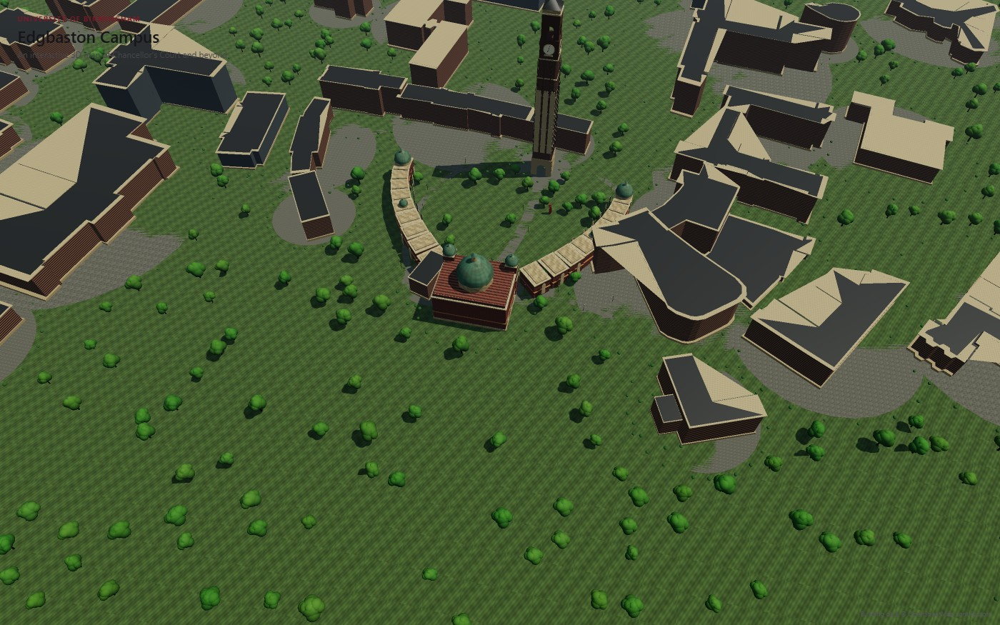
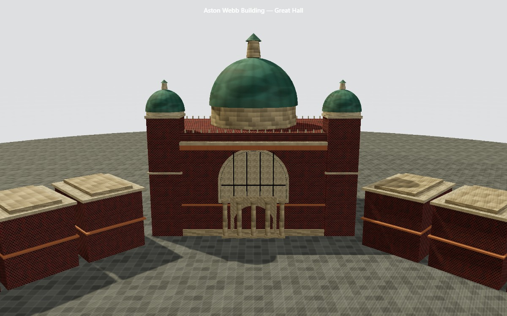
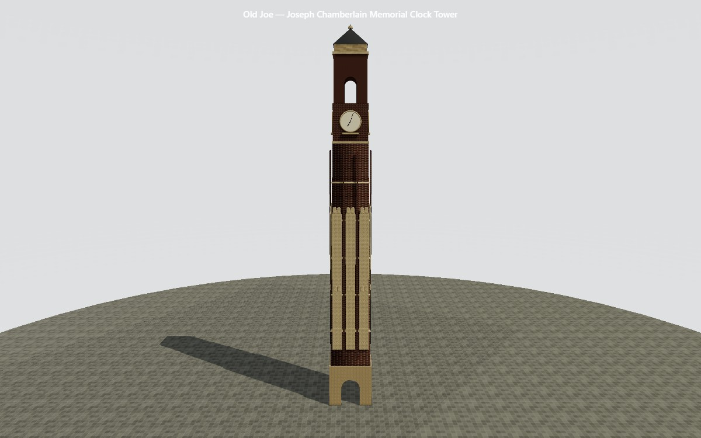
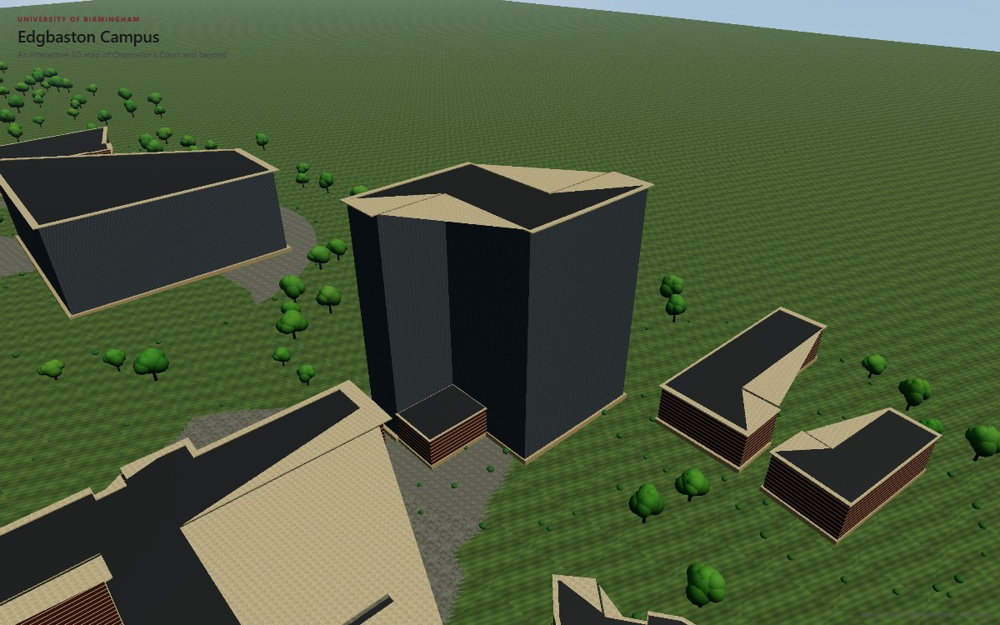

# University of Birmingham — Interactive Campus Map

A polished, interactive 3D digital-twin map of the University of
Birmingham's Edgbaston campus — a satellite-style overhead map you explore
by hovering and clicking buildings, with a cinematic camera intro and a
dedicated 360° detail viewer for the campus's hero landmarks. This is a
map/digital-twin experience, not a game: no first-person controls, no
ground-level camera, no game mechanics.

**Old Joe** (the Joseph Chamberlain Memorial Clock Tower) and the **Aston
Webb / Great Hall** are fully modelled landmarks with a dedicated "Explore
in 3D" viewer. The other 58 buildings — real ones, real positions, real
plan shapes — come straight from OpenStreetMap: Muirhead Tower, the Main
Library, the Guild of Students, the Barber Institute, halls of residence,
sports facilities and more, extruded from their actual footprint polygons
rather than placed by hand.

Built with Vite + TypeScript + Three.js. No game engine, no UI framework —
every texture is generated procedurally on a `<canvas>` at startup, and
every building is either bespoke-modelled (Old Joe, Aston Webb) or
generated from real footprint data (everything else).

## Screenshots

| | |
|---|---|
|  |  |
| Chancellor's Court, overhead | Aston Webb / Great Hall — twin domed turrets, the great arched window, columned entrance |
|  |  |
| Old Joe — Joseph Chamberlain Memorial Clock Tower | Muirhead Tower and its neighbours, real footprints and facades |

## Running it

```bash
npm install
npm run dev      # http://localhost:5173, hot-reloading dev server
npm run build    # type-checks with tsc, then produces dist/
npm run preview  # serves the production build locally
```

## Using it

- A white branded loading screen, then a cinematic camera swoop, opens the
  experience — from a distant "satellite" framing down into the default
  overhead view of Chancellor's Court.
- **Drag** to orbit, **scroll** to zoom, **right-drag** to pan. The camera
  is deliberately kept overhead — a satellite/map tilt range, never a
  ground-level or eye-level view (there's a separate detail viewer for
  getting close to a specific building).
- **Hover** a building to see its name, a soft glow ring and a radar-ping
  ripple.
- **Click** a building to fly the camera to it (with a cinematic drone-arc,
  not a straight cut) and open its info panel.
- **Explore in 3D** (on the info panel, where available) opens a dedicated
  360° studio viewer for that building — drag to rotate, scroll to zoom,
  "Reset View", "Back to Campus".
- **Locations** / **Layers** (bottom-left) list all 60 buildings for quick
  navigation, and let you toggle whole categories (Academic, Sport,
  Accommodation, ...) on and off.

## File structure

```
src/
  main.ts                      entry point — boots App
  App.ts                       top-level orchestrator: renderer, camera,
                                cinematic intro, overview/detail mode
                                switching, bloom/vignette post-processing

  core/
    CameraTransition.ts        dependency-free eased camera fly-to tween
                                with a cinematic drone-arc

  world/
    campusData.ts               real-world-derived anchors (Old Joe, Aston
                                 Webb) — the single source of truth for
                                 their position/size
    campusBuildings.ts            real building footprints/heights for the
                                   wider campus, sourced from OpenStreetMap
    buildings.ts                 the building registry: id, name, category,
                                  description, camera framing, model factory
                                  — generates 58 entries from
                                  campusBuildings.ts plus the 2 bespoke ones
    CampusScene.ts                assembles terrain + landscaping + every
                                   registered building, tags meshes for picking
    Lighting.ts                   sky, sun, ambient — one polished preset
    Terrain.ts, Landscaping.ts    ground, paths, paving, trees, lamp posts
    ArchitectureKit.ts             reusable procedural building components
    OldJoe.ts, AstonWebb.ts         the two bespoke, fully-modelled landmarks
    GenericBuilding.ts               extrudes a real OSM footprint polygon
                                      into a massed volume (punched-window
                                      facade, roof, cornice trim, paved apron)

  interaction/
    PickingController.ts        raycasting hover/click against tagged
                                 meshes, hover ring + radar-ping + spring lift

  viewer/
    DetailViewer.ts             isolated studio scene + OrbitControls for
                                 "Explore in 3D", with a scale/spin reveal

  ui/
    LoadingScreen.ts            branded splash covering scene construction
    HeaderBar.ts                 persistent title/description
    InstructionHint.ts            self-dismissing usage hint
    Tooltip.ts                  hover name label
    InfoPanel.ts                 click info card + "Explore in 3D"
    ViewerUI.ts                   Back to Campus / Reset View overlay
    ExplorePanel.ts                Locations list + Layers category toggle

  materials/
    proceduralTextures.ts       CanvasTexture generators (brick, stone,
                                 grass with mowing stripes, sky+clouds,
                                 window-grid facades, ...)
    materials.ts                 shared MeshStandardMaterial instances
```

**Adding a new bespoke building** (Old Joe/Aston Webb-style) is one entry
in `buildings.ts` with a `buildModel()` factory. **Real campus buildings**
are entirely data-driven — re-running the Overpass extraction (see below)
and regenerating `campusBuildings.ts` is enough; `buildings.ts` turns each
entry into a full `BuildingDefinition` automatically. Nothing in the
picking, hover, info panel, Locations list, Layers toggle, or
camera-transition code needs to change either way.

## Architectural approach

- **1 world unit = 1 metre.** World origin `(0,0,0)` is the real
  OpenStreetMap centroid of Old Joe's footprint. `+X` = east, `+Z` = south.
- **Real footprints, not guesses.** `campusBuildings.ts` was generated by
  querying the Overpass API for named `building=university` ways (plus a
  short curated allowlist of clearly campus-affiliated halls/sport
  buildings) inside the Edgbaston campus bounding box, then converting
  each footprint polygon to local metres relative to Old Joe.
  `GenericBuilding.ts` extrudes that polygon directly via
  `THREE.ExtrudeGeometry` — real position, real plan shape, real height,
  not a rectangle.
- **One renderer, two scenes.** `App` owns a single `THREE.WebGLRenderer`
  and swaps between the campus overview scene and the `DetailViewer`'s
  isolated studio scene — cheaper and simpler than a second WebGL context.
  Both are post-processed through an `EffectComposer` (bloom) plus a CSS
  vignette for a filmic look.
- **The camera stays a map.** `maxPolarAngle` is capped well short of the
  horizon in the overview, so orbiting always reads as tilting a satellite
  view, never as walking up to eye level.
- **Picking is data-driven.** `CampusScene` tags every mesh belonging to a
  building with `userData.buildingId`; `PickingController` raycasts only
  against that tagged set (never trees/lamps/terrain), so it stays cheap
  as the campus grows, and skips buildings hidden by the Layers toggle.
- **Procedural geometry kit** (`ArchitectureKit.ts`): `createBrickWall`,
  `createArchedPassageWall`, `createArchedWindow`, `createMullionedWindow`,
  `createDome`, `createTurret`, `createCornice`, `createFrieze`,
  `createStairs`, `createEntranceRecess`, plus a texture-tiling helper
  (`tiledMaterial`) so brick/stone coursing reads at a consistent scale
  regardless of how big or small a wall is. Old Joe and Aston Webb are
  built entirely from these.
- **Instancing**: trees, foundation-planting shrubs, lamp posts and their
  glow spheres are drawn with `InstancedMesh` — over a thousand of them
  scattered across the real campus extent cost only a handful of draw
  calls. Trees avoid every building footprint and path; shrubs form a
  planting ring around all 60 buildings.
- **Textures** are all generated at runtime with `CanvasTexture` — no
  downloaded or scraped imagery, so there are no licensing concerns.

## Source / accuracy notes

- **Old Joe and Aston Webb**: their anchor coordinates are the real
  OpenStreetMap centroid of each building's footprint (© OpenStreetMap
  contributors, ODbL). Their massing follows Historic England's listing
  descriptions ([Great Hall / Quadrant Range](https://historicengland.org.uk/listing/the-list/list-entry/1076133),
  [Chamberlain Tower](https://historicengland.org.uk/listing/the-list/list-entry/1210306)),
  reasoned into bespoke procedural geometry — not a photogrammetry scan.
- **The other 58 buildings**: real position, real footprint polygon, real
  height, all from OpenStreetMap (© OpenStreetMap contributors, licensed
  ODbL — extracted via the Overpass API on the `building=university`
  tag plus a short curated allowlist for halls/sport buildings clearly on
  campus). The *massing* is still simplified (a punched-window facade
  texture, a flat roof, a thin cornice trim) rather than each building's
  real architecture — the shape and position are real, the facade detail
  is not.
- No University photographs or copyrighted imagery were used anywhere.

## What's deliberately not here yet

- Building interiors (everything is an exterior shell).
- Bespoke individual facades on the 58 OSM-derived buildings — they use the
  real footprint, a stone plinth and cornice, and one of two detailed
  Edwardian/modern facade textures (arched ground-floor windows, banded
  coursing) by category/height, not a one-off model per building the way
  Old Joe and Aston Webb are.
- A dedicated detail viewer for those 58 buildings — only Old Joe and
  Aston Webb have "Explore in 3D" today.
- Search, wayfinding/routing, opening hours, accessibility info.

## Future features this is architected for

- **Search**: `BUILDINGS` is already a flat, fully-described array —
  search is a filter over `name`/`category`/`description`.
- **"Find my way to..."**: `groundPosition` on every building is already
  plain world-space data; routing would path over that plus the existing
  `PATHS` network in `campusData.ts`.
- **More real buildings**: re-run the Overpass query with a wider bounding
  box or a broader tag allowlist and regenerate `campusBuildings.ts`.
- **Multiple campus areas**: `CampusScene` doesn't assume a single
  cluster — a second area is another Overpass extraction plus a
  camera-framing "jump to area" affordance.
- **Mobile/touch**: OrbitControls already handles touch gestures
  (one-finger rotate, two-finger pinch/pan); the UI panels would need
  responsive breakpoints.
- **Open Day / prospective-student mode**: a filtered `BUILDINGS` subset
  plus a guided sequence of `flyToBuilding` calls — both already exist.

## Known limitations of this pass

- Buildings generated by `GenericBuilding.ts` don't cast/receive shadows
  (the sun's shadow frustum is sized for the Chancellor's Court core; a
  building outside it would otherwise sample the shadow map's clamped
  edge and render solid black) — Old Joe, Aston Webb and the nearby
  landscaping still cast/receive shadows normally.
- Camera fly-to transitions and CSS panel transitions are driven by
  `requestAnimationFrame`/CSS transitions, which browsers throttle for a
  backgrounded or not-currently-rendered tab — normal in any real,
  focused browser tab.
- Terrain elevation is a small procedural undulation, not survey contour
  data — see `TERRAIN.elevation` in `campusData.ts` to retune it.
